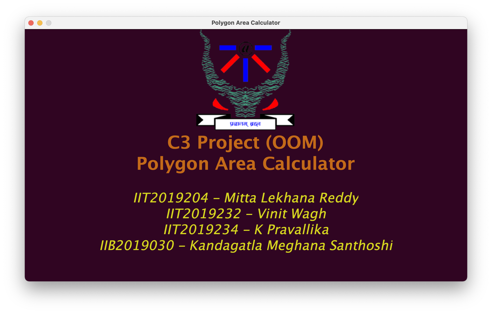
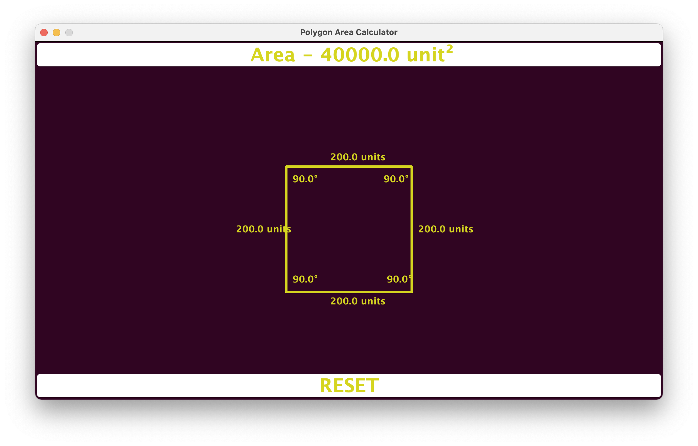

# [Polygon Area Calculator](/)

---

[**PolygonAreaCalculator**](/PolygonAreaCalculator/)
>Contains the source code of the project

***
[**PolygonAreaCalculator.jar**](PolygonAreaCalculator.jar)
>is a runnable jar file

**To run it:** 
- Open Command Prompt.
- Navigate to the directory in which the file is present.
- Type "java -jar PolygonAreaCalculator.jar"

***
>A visual representation of what the program should look like.

***

